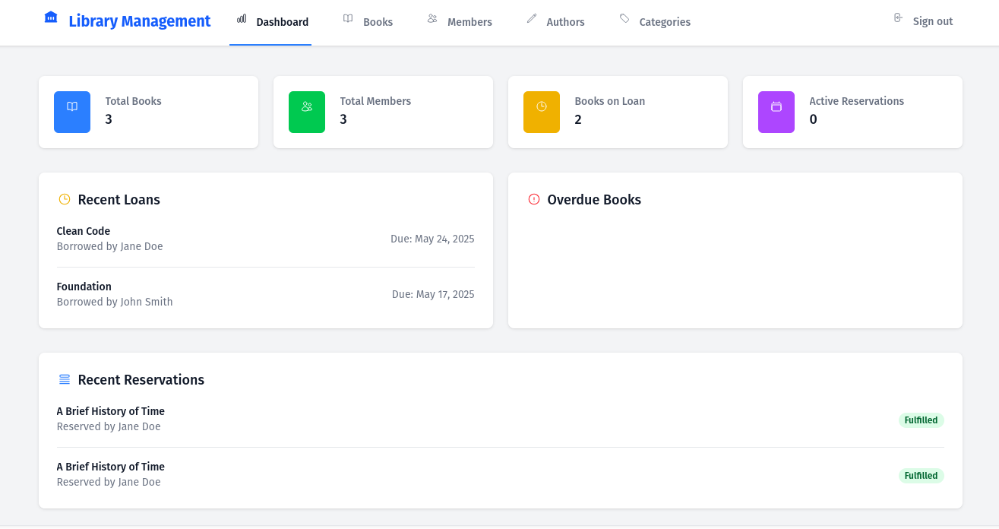
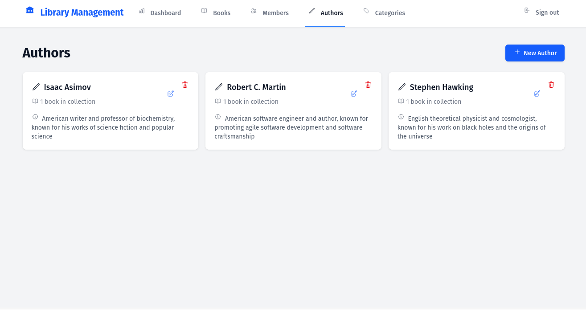
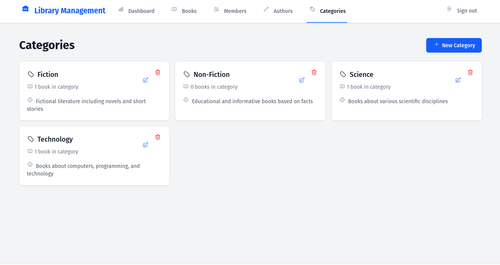

# Stately

A modern library management system built with Ruby on Rails 8, featuring real-time updates using Hotwire, and a beautiful UI powered by Tailwind CSS.



## Features

- 📚 Complete book management with ISBN tracking
- 👥 Member management with status tracking
- 📖 Book loans and reservations
- 🔄 Real-time updates using Hotwire
- 👤 User authentication with Devise
- 🔒 Role-based authorization using Pundit
- 📱 Responsive design using Tailwind CSS
- 📧 Automated email notifications
- ⏰ Background jobs for reservations and reminders



## Technologies

- Ruby 3.3+
- Rails 8.0.2
- Hotwire (Turbo & Stimulus)
- Tailwind CSS
- SQLite3
- Devise for authentication
- Pundit for authorization
- Solid Queue for background jobs
- Docker support

## Prerequisites

- Ruby 3.3 or higher
- Node.js 18+ and Yarn
- SQLite3
- Docker (optional)

## Setup

1. Clone the repository
```bash
git clone https://github.com/yourusername/stately.git
cd stately
```

2. Install dependencies
```bash
bundle install
```

3. Setup the database
```bash
rails db:create
rails db:migrate
rails db:seed
```

4. Start the development server
```bash
bin/dev
```

The application will be available at http://localhost:3000

## Docker Setup

1. Build the Docker image:
```bash
docker build -t stately .
```

2. Run the container:
```bash
docker compose up
```

## Background Jobs

The application uses Solid Queue for processing background jobs:

- Reservation expiration checks
- Loan due date reminders
- Email notifications



## Testing

To run the test suite:

```bash
rails test
```

## Deployment

The application includes Kamal configuration for easy deployment:

```bash
bundle exec kamal deploy
```

## License

This project is licensed under the BSD 3-Clause License - see the [LICENSE.md](LICENSE.md) file for details.

## Contributing

1. Fork the repository
2. Create your feature branch (`git checkout -b feature/amazing-feature`)
3. Commit your changes (`git commit -m 'Add some amazing feature'`)
4. Push to the branch (`git push origin feature/amazing-feature`)
5. Open a Pull Request

## Support

For support, please open an issue in the GitHub repository.
